<h1 align="center">Hi 👋, I'm Raphaël Plassart</h1>
<h3 align="center">
Full-Stack Web & Mobile Developer · Product-oriented · France 🇫🇷
</h3>

  

---

### 🚀 About me

- 💼 **Full-Stack & Mobile Developer** with 3+ years of experience in startups & SaaS  
- 🏗️ I build products **from scratch to production** (web, mobile & infra)
- 🧠 Strong **product mindset** + clean architecture
- 🎯 Focused on performance, DX, scalability & long-term vision

---

### 🔭 Current work

- **Full-Stack & Mobile Developer @ Tkorp**  
  Building and scaling production web & mobile applications

- **Founder & Lead Developer – QoreDB**  
  🧠 Unified SQL & NoSQL database with a modern DX  
  👉 https://github.com/raphplt/QoreDB

---

### 🌱 Currently learning

- **Rust** (systems, performance & safety)
- **DevOps** (Docker, CI/CD, VPS, infra automation)

---

### 🧑‍💻 Freelance missions

- ⚡ **Web, SaaS & MVP development**
- 🧩 Architecture, backend APIs, dashboards, tooling

👉 https://atlas.raphael-plassart.com/

---

### 🌐 Online presence

- 👨‍💻 Portfolio: https://www.raphael-plassart.com  
- 💼 LinkedIn: https://linkedin.com/in/raphaël-plassart  
- 📫 Contact: **raphael.plassart@gmail.com**

---

### 🛠️ Tech stack

Frontend

       

Backend

       

Mobile

    

Databases

      

DevOps & Infrastructure

       

Tooling

   

---
### 📊 GitHub Stats

  
  

---

### 🚀 Featured Project

  

