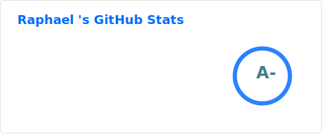
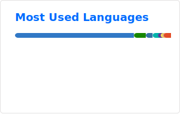

## Raphaël Plassart

Full-stack developer — web, mobile, and a bit of systems. France.

I build products end to end, from first commit to production.

**Currently**
- Full-stack & mobile developer @ Tkorp
- Building [QoreDB](https://github.com/raphplt/QoreDB) — a local-first desktop client for SQL & NoSQL databases (Rust, Tauri, React)

**Working with**
TypeScript · React · Next.js · React Native · NestJS · Node.js · Rust · PostgreSQL · MongoDB · Redis · Docker · Linux

---

  
  

